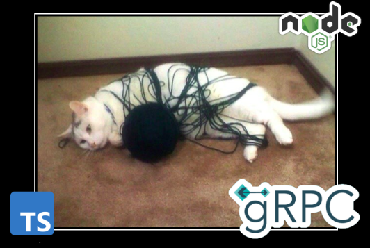
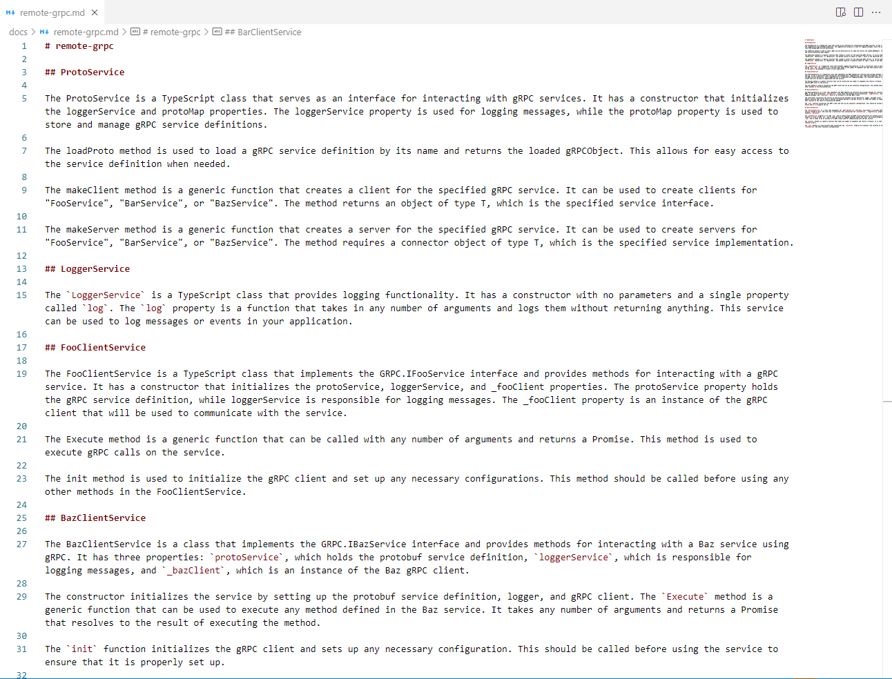

# ✡️ node-grpc-monorepo

> Lerna monorepo ready for microservice development



## Тебе не нужно разбивать монолит, если его можно импортировать

До изобретения микросервисов бизнес выделял много времени на проектирование сложных систем с использованием доменной модели. Однако, новые условия рынка потребовали урезать бюджет IT отдела, чистая архитектура оставалась в голове программиста, а код писался только исходя из сию минутной выгоды. Однако, подрастающее поколение специалистов изучают программирование в режиме закрыть максимальное количество пунктов резюме, при этом, вопрос повторного использования другим специалистом кода не рассматривался, так как за будущие проблемы не платят деньги. То что такое поведение коллег по меньшей мере не культурно не является сутью вопроса, проблема в том, что плохой код пораждает незаменимых специалистов и, при уходе такого специалиста, так как передать работу полностью технически невозможно, срыву проекта в средней временной перспективе


Проблему можно избежать техническими методами, грамотно декомпозировав код между микросервисами. Ранее, доменная модель [Model View Controller](https://en.wikipedia.org/wiki/Model–view–controller) позволяла удерживать читаемость проекта так, чтобы специалиста можно было быстро подменить, однако, так как ООП языки (Java, C#) используют пространства имен для разделения модулей, требовалось писать код в монолите.


С появлением [монорепозиториев](https://en.wikipedia.org/wiki/Monorepo) проблемы можно избежать, грамотно организовав структура проекта на старте. Данный проект представляет собой микросервисную архитектуру, где host (папка `apps`) приложения взаимодействуют с микросервисами (папка `services`) через шину событий [GRPC](https://en.wikipedia.org/wiki/GRPC), повторно используя общий код луковичной композиции сервисов со слоем логирования и базы данных из общего кода (папка `modules`)

## Упрощаем взаимодействие микросервисов

**1. Boilerplate код, чтобы gRPC заработал, громоздок. Создание клиента и сервера gRPC вынесено в общий код, прикладной код запускает микросервис в одну строку**

```proto
syntax = "proto3";

message FooRequest {
    string data = 1;
}

message FooResponse {
    string data = 1;
}

service FooService {
  rpc Execute (FooRequest) returns (FooResponse);
}

```

Есть `proto` файл, описывающий `FooService` с методом `Execute`, получающий одним аргументом объект со строкой `data`


```tsx
export class FooClientService implements GRPC.IFooService {

    private readonly protoService = inject<ProtoService>(TYPES.protoService);
    private readonly loggerService = inject<LoggerService>(TYPES.loggerService);

    private _fooClient: GRPC.IFooService = null as never;

    Execute = async (...args: any) => {
        this.loggerService.log("remote-grpc fooClientService Execute", { args });
        return await this._fooClient.Execute(...args);
    };

    protected init = () => {
        this._fooClient = this.protoService.makeClient<GRPC.IFooService>("FooService")
    }

}
```

Файлы `*.proto` преобразуются в `*.d.ts` скриптом `scripts/generate-dts.mjs` (генерирует простратство имен `GRPC`), далее пишется обертка, чтобы уточнить типы на стороне Typescript.

```tsx
import { grpc } from "@modules/remote-grpc";

export class FooService {
    Execute = (request: any) => {
        if (request.data !== "foo") {
            throw new Error("data !== foo")
        }
        return { data: "ok" }
    }
}

grpc.protoService.makeServer("FooService", new FooService);
```

Далее, сервер gRPC шарит методы класса в одну строчку. Методы возвращают `Promise`, можем делать `await` и бросать исключения, в дополнении к `@grpc/grpc-js` не нужно работать с [callback hell](https://en.wiktionary.org/wiki/callback_hell).


```tsx
import { grpc } from "@modules/remote-grpc";

import test from "tape";

test('Except fooClientService will return output', async (t) => {
  const output = await grpc.fooClientService.Execute({ data: "bar" });
  t.strictEqual(output.data, "ok");
})

```

**2. Взаимодействие с базой данных (MVC), вынесен в общий код и доступно из приложения хоста, из сервисов и других библиотек**

```tsx
import { db } from "@modules/remote-db";
await db.todoViewService.create({ title: "Hello world!" });
console.log(await db.todoRequestService.getTodoCount());
```

Используется сервер приложений [Appwrite](https://appwrite.io), обертка над MariaDB, позволяющая с ходу получить высчитывание метрик запросов, учет места на жестком диске, авторизацию OAuth 2.0, бекапы и [шину событий websocket](https://appwrite.io/docs/apis/realtime)

## Упрощаем разработку

Критической проблемой микросервисной архитектуры является интегрируемость (IDE - **Integrated** development environment): программисту сложно вклиниться отладчиком, как правило, новички осуществляют debug через `console.log`. Особенно это заметно, если код изначально работает только в docker.


Помимо основного хост приложения `apps/host-main` (REST API веб сервер), сделана точка входа `apps/host-test` для разработки тестированием. Она не использует test runtime, другими словами, можем прямо в `public static void main()` дернуть ручку микросервиса или метод контроллер базы данных без postman. Сразу добавлен шорткат `npm run test`, который комилирует и запускает приложение. Так же, можно перейти в папку любого сервиса или хоста и запустить `npm run start:debug`

## Упрощаем деплой

Используя [Lerna](https://lerna.js.org/), компиляция и запуск проекта осуществляется в одну команду через `npm start` (параллельная сборка). Хотим пересобрать, запускаем команду ещё раз. Хотим запустить новый дописанный код - запускаем `npm start && npm run test`. Окружение для запуска проекта установится автоматически после `npm install` благодаря скрипту `postinstall`

```json
{
    "name": "node-grpc-monorepo",
    "private": true,
    "scripts": {
        "test": "cd apps/host-test && npm start",
        "start": "npm run pm2:stop && npm run build && npm run pm2:start",
        "pm2:start": "pm2 start ./config/ecosystem.config.js",
        "pm2:stop": "pm2 kill",
        "build": "npm run build:modules && npm run build:services && npm run build:apps && npm run build:copy",
        "build:modules": "dotenv -e .env -- lerna run build --scope=@modules/*",
        "build:apps": "dotenv -e .env -- lerna run build --scope=@apps/*",
        "build:services": "dotenv -e .env -- lerna run build --scope=@services/*",
        "build:copy": "node ./scripts/copy-build.mjs",
        "docs": "sh ./scripts/linux/docs.sh",
        "docs:win": ".\\scripts\\win\\docs.bat",
        "docs:gpt": "node ./scripts/gpt-docs.mjs",
        "postinstall": "npm run postinstall:lerna && npm run postinstall:pm2",
        "postinstall:lerna": "npm list -g lerna || npm install -g lerna",
        "postinstall:pm2": "npm list -g pm2 || npm install -g pm2",
        "proto:dts": "node ./scripts/generate-dts.mjs",
        "proto:path": "node ./scripts/get-proto-path.mjs",
        "translit:rus": "node ./scripts/rus-translit.cjs"
    },
```

Для автоматического перезапуска микросервисов и хостов при ошибке, используется менеджер процессов [PM2](https://pm2.keymetrics.io/). Из коробки предоставляет [crontab](https://crontab.guru/), что удобно, так как не нужно настраивать со стороны операционки.

```js
const dotenv = require('dotenv')
const fs = require("fs");

const readConfig = (path) => dotenv.parse(fs.readFileSync(path));

const appList = [
    {
        name: "host-main",
        exec_mode: "fork",
        instances: "1",
        autorestart: true,
        max_restarts: "5",
        cron_restart: '0 0 * * *',
        max_memory_restart: '1250M',
        script: "./apps/host-main/build/index.mjs",
        env: readConfig("./.env"),
    },
];

const serviceList = [
    {
        name: "baz-service",
        exec_mode: "fork",
        instances: "1",
        autorestart: true,
        max_restarts: "5",
        cron_restart: '0 0 * * *',
        max_memory_restart: '1250M',
        script: "./services/baz-service/build/index.mjs",
        env: readConfig("./.env"),
    },
    {
        name: "bar-service",
        exec_mode: "fork",
        instances: "1",
        autorestart: true,
        max_restarts: "5",
        cron_restart: '0 0 * * *',
        max_memory_restart: '1250M',
        script: "./services/bar-service/build/index.mjs",
        env: readConfig("./.env"),
    },
    {
        name: "foo-service",
        exec_mode: "fork",
        instances: "1",
        autorestart: true,
        max_restarts: "5",
        cron_restart: '0 0 * * *',
        max_memory_restart: '1250M',
        script: "./services/foo-service/build/index.mjs",
        env: readConfig("./.env"),
    },
];

module.exports = {
    apps: [
        ...appList,
        ...serviceList,
    ],
};

```

## Упрощаем логирование

Как можно заметить в [ProtoService](modules/remote-grpc/src/services/base/ProtoService.ts), все вызовы gRPC пишутся в лог, в том числе с аргументами и результатом выполнения или ошибкой.

```log
{"level":30,"time":1731179018964,"pid":18336,"hostname":"DESKTOP-UDO3RQB","logLevel":"log","createdAt":"2024-11-09T19:03:38.964Z","createdBy":"remote-grpc.log","args":["remote-grpc fooClientService Execute",{"args":[{"data":"foo"}]}]}
{"level":30,"time":1731179018965,"pid":18336,"hostname":"DESKTOP-UDO3RQB","logLevel":"log","createdAt":"2024-11-09T19:03:38.965Z","createdBy":"remote-grpc.log","args":["remote-grpc protoService makeClient calling service=FooService method=Execute requestId=rbfl7l",{"request":{"data":"foo"}}]}
{"level":30,"time":1731179018984,"pid":18336,"hostname":"DESKTOP-UDO3RQB","logLevel":"log","createdAt":"2024-11-09T19:03:38.984Z","createdBy":"remote-grpc.log","args":["remote-grpc protoService makeClient succeed service=FooService method=Execute requestId=rbfl7l",{"request":{"data":"foo"},"result":{"data":"ok"}}]}
{"level":30,"time":1731179018977,"pid":22292,"hostname":"DESKTOP-UDO3RQB","logLevel":"log","createdAt":"2024-11-09T19:03:38.977Z","createdBy":"remote-grpc.log","args":["remote-grpc protoService makeServer executing method service=FooService method=Execute requestId=7x63h",{"request":{"data":"foo"}}]}
{"level":30,"time":1731179018978,"pid":22292,"hostname":"DESKTOP-UDO3RQB","logLevel":"log","createdAt":"2024-11-09T19:03:38.978Z","createdBy":"remote-grpc.log","args":["remote-grpc protoService makeServer method succeed requestId=7x63h",{"request":{"data":"foo"},"result":{"data":"ok"}}]}
```

Логи пишутся с ротацией. Когда файл `debug.log` достигнет лимита 100Mb, он будет сжат в `20241003-1132-01-debug.log.gz`. Дополнительно, можете писать свои логи, используя [pinolog](https://www.npmjs.com/package/pinolog)

## Упрощаем документирование

Разработка предполагает использование [функционального программирования](https://en.wikipedia.org/wiki/MapReduce) в `host` приложениях и объектно ориентированного по [SOLID](https://en.wikipedia.org/wiki/SOLID) в сервисах и общем коде. Как следствие

1. Код на классах
2. Есть инъекция зависимостей

Файлы `rollup.config.mjs` создают [types.d.ts](modules/remote-grpc/types.d.ts), содержащие объявления классов. Из них генерируется [API Reference](https://github.com/react-declarative/react-declarative/blob/master/docs/auto/interfaces/IQuery.md) в формате markdown. Далее, файлы markdown попадают в нейронку [Nous-Hermes-2-Mistral-7B-DPO](./scripts/gpt-docs.mjs), которая возвращает результат в читаемом человеком виде



Да, верно, автоматическая генерация документации через [CI/CD](https://en.wikipedia.org/wiki/CI/CD). ~~Меняем промпт и видим, соответствует ли класс SOLID~~

## С чего начать разработку

Настройте окружение

```bash
cp .env.example .env
npm install
npm start
```

Откройте файл [modules/remote-grpc/src/config/params.ts](modules/remote-grpc/src/config/params.ts). Добавьте микросервис, придумав, какой порт он будет занимать. 

```tsx
export const CC_GRPC_MAP = {
    "FooService": {
        grpcHost: "localhost:50051",
        protoName: "foo_service",
        methodList: [
            "Execute",
        ],
    },
    // Сюда
...

```

Далее следуя паттерну Dependency injection добавьте тип сервиса в [modules/remote-grpc/src/config/types.ts](modules/remote-grpc/src/config/types.ts), инстанс сервиса в [modules/remote-grpc/src/config/provide.ts](modules/remote-grpc/src/config/provide.ts), и инъекцию в [modules/remote-grpc/src/services/client](modules/remote-grpc/src/services/client).

```tsx
const clientServices = {
    fooClientService: inject<FooClientService>(TYPES.fooClientService),
    barClientService: inject<BarClientService>(TYPES.barClientService),
    bazClientService: inject<BazClientService>(TYPES.bazClientService),
    // Сюда
};

init();

export const grpc = {
    ...baseServices,
    ...clientServices,
};

```

Далее, скопируйте папку [services/foo-service](services/foo-service) и на её основе пропишите логику. Взаимодействие с базой нужно вынести в [modules/remote-db](modules/remote-db) по этому же принципу. Не забывайте про логирование в LoggerService, каждый метод `view` слоя должен записать в лог имя сервиса, имя метода и аргументы

## Спасибо за внимание!
